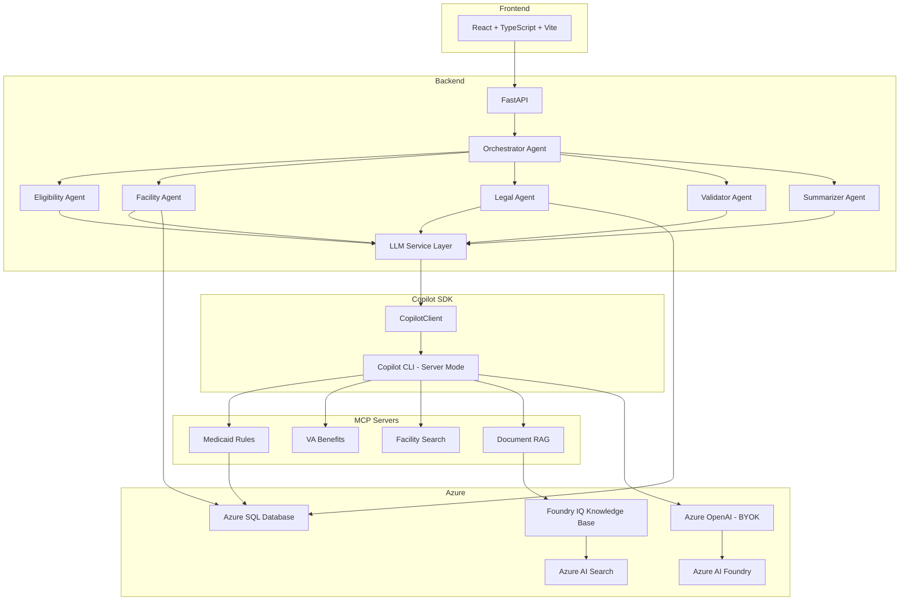

# CareNav Florida — Rick's Engineering Workbook

**For: Rick Weyenberg**
**From: Gregory Katz**
**Project: CareNav Florida — GitHub Copilot SDK Enterprise Challenge**
**Submission Deadline: March 7, 2026 at 10 PM PST**

Built by Gregory Katz and Rick Weyenberg. Code is as-is, open source.

---

## What This Document Covers

This is your single source of truth for everything that needs to happen between now and when you hand off to Gregory. There are four major workstreams:

1. **Data Layer Migration** — Replace SQLite with Azure SQL Database, replace ChromaDB with Azure AI Search. Full replacement, no fallbacks.
2. **GitHub Copilot SDK Integration** — Install the SDK, wire it into the agent architecture, register MCP servers, test end-to-end.
3. **Repo Cleanup & Challenge Files** — README, screenshots, AGENTS.md, mcp.json, CI pipeline, submission materials
4. **Testing** — All tests pass against Azure data layer with Copilot SDK

All work is done locally in VS Code.

Gregory handles three things after you hand off: presentation deck, demo video, and final submission.

---

## Current State of the Codebase

**What exists and works today:**
- React + TypeScript frontend (Vite) with Vision UI dark theme
- Python FastAPI backend with 6 AI agents (orchestrator, eligibility, facility, legal, validator, summarizer)
- 51 demo documents for Margaret Thompson scenario
- 39 end-to-end tests at 100% pass rate
- Azure OpenAI integration (gpt-5.2 via East US 2 endpoint)
- SQLite for structured data (patients, tasks, documents) — **being replaced**
- ChromaDB for vector embeddings / RAG — **being replaced**

**New UI Components (recently added):**
- Executive tab with Recent Wins, Hot List, Care Journey Roadmap
- Medical tab with diagnoses, medications, vitals, care level
- Insurance tab with Medicaid, Medicare, Supplemental policies
- Facility tab with selected facility details, costs, contacts
- Contacts tab with family, medical, legal, facility contacts
- Money tab with bills, income phases, benefit pipeline, assets

**RAG Knowledge Base (ready for Azure AI Search migration):**
- 10 comprehensive policy documents indexed in ChromaDB
- Covers: Florida Medicaid ICP, VA Aid & Attendance, Medicare coordination, ALF regulations, estate planning, spend-down strategies
- Export endpoint: `GET /api/knowledge/export/azure-search/` returns documents in Azure AI Search bulk upload format
- Query endpoint: `POST /api/knowledge/query/` for semantic search

**Repo location:**
```bash
git clone https://github.com/gregnatkatz/carenav.git
cd carenav
git checkout MAIN1
```

---

## WORKSTREAM 1: Data Layer Migration

### 1A: Provision Azure Resources

You need to create three Azure resources from scratch. Use the Azure CLI or the Azure Portal — whichever you prefer.

#### Create a Resource Group (if needed)

```bash
az login
az group create --name carenav-rg --location eastus2
```

#### Create Azure SQL Server + Database

```bash
# Create the SQL Server
az sql server create \
  --name carenav-sql-server \
  --resource-group carenav-rg \
  --location eastus2 \
  --admin-user carenavadmin \
  --admin-password '<GENERATE_A_STRONG_PASSWORD>'

# Create the database (S0 tier is fine for a POC)
az sql db create \
  --name carenav-db \
  --server carenav-sql-server \
  --resource-group carenav-rg \
  --service-objective S0 \
  --backup-storage-redundancy Local

# Allow Azure services to access the server
az sql server firewall-rule create \
  --server carenav-sql-server \
  --resource-group carenav-rg \
  --name AllowAzureServices \
  --start-ip-address 0.0.0.0 \
  --end-ip-address 0.0.0.0

# Allow your local IP (replace with your actual IP)
az sql server firewall-rule create \
  --server carenav-sql-server \
  --resource-group carenav-rg \
  --name AllowMyIP \
  --start-ip-address <YOUR_IP> \
  --end-ip-address <YOUR_IP>
```

After creation, your connection details will be:
```
Server: carenav-sql-server.database.windows.net
Database: carenav-db
Username: carenavadmin
Password: <whatever you set>
```

#### Create Azure AI Search Instance

```bash
az search service create \
  --name carenav-search \
  --resource-group carenav-rg \
  --location eastus2 \
  --sku basic \
  --partition-count 1 \
  --replica-count 1
```

After creation, get your search endpoint and admin key:
```bash
# Get the endpoint
az search service show \
  --name carenav-search \
  --resource-group carenav-rg \
  --query "hostName" -o tsv
# Result: carenav-search.search.windows.net
# Your endpoint is: https://carenav-search.search.windows.net

# Get the admin key
az search admin-key show \
  --service-name carenav-search \
  --resource-group carenav-rg \
  --query "primaryKey" -o tsv
```

#### Verify Azure OpenAI Access

Gregory already has Azure OpenAI deployed. Confirm you have access to these endpoints:

```
Endpoint: https://ahfy26-resource.cognitiveservices.azure.com/
Deployment: gpt-5.2 (chat completions)
Deployment: text-embedding-3-large (embeddings for vector search)
API Version: 2024-12-01-preview
```

Gregory will provide the API key if you don't have it.

---

### 1B: Replace SQLite with Azure SQL Database

This is a full replacement. Remove all SQLite code and dependencies.

#### Install Dependencies

```bash
cd src/backend
poetry add aioodbc pyodbc
poetry remove aiosqlite  # Remove SQLite dependency entirely
```

Make sure the ODBC Driver 18 for SQL Server is installed on your machine:
- **Mac**: `brew install microsoft/mssql-release/msodbcsql18`
- **Windows**: Download from https://learn.microsoft.com/en-us/sql/connect/odbc/download-odbc-driver-for-sql-server
- **Linux**: Follow https://learn.microsoft.com/en-us/sql/connect/odbc/linux-mac/installing-the-microsoft-odbc-driver-for-sql-server

#### Create Database Schema

Create a migration script at `src/backend/scripts/create_schema.py`:

```python
# Built by Gregory Katz and Rick Weyenberg
# Code is as-is, open source

"""
Creates the CareNav database schema in Azure SQL.
Run once: python src/backend/scripts/create_schema.py
"""

import pyodbc
import os
from dotenv import load_dotenv

load_dotenv()

conn_str = (
    f"DRIVER={{ODBC Driver 18 for SQL Server}};"
    f"SERVER={os.getenv('AZURE_SQL_SERVER')};"
    f"DATABASE={os.getenv('AZURE_SQL_DATABASE')};"
    f"UID={os.getenv('AZURE_SQL_USERNAME')};"
    f"PWD={os.getenv('AZURE_SQL_PASSWORD')};"
    f"Encrypt=yes;TrustServerCertificate=no;"
)

schema = """
-- Patients
CREATE TABLE patients (
    id NVARCHAR(36) PRIMARY KEY DEFAULT NEWID(),
    first_name NVARCHAR(100) NOT NULL,
    last_name NVARCHAR(100) NOT NULL,
    date_of_birth DATE,
    ssn_last4 NVARCHAR(4),
    address NVARCHAR(500),
    city NVARCHAR(100),
    state NVARCHAR(2) DEFAULT 'FL',
    zip_code NVARCHAR(10),
    phone NVARCHAR(20),
    email NVARCHAR(200),
    current_location NVARCHAR(50),
    care_level NVARCHAR(50),
    veteran_status NVARCHAR(50),
    medicaid_status NVARCHAR(50),
    total_assets DECIMAL(12,2),
    monthly_income DECIMAL(10,2),
    created_at DATETIME2 DEFAULT GETDATE(),
    updated_at DATETIME2 DEFAULT GETDATE()
);

-- Documents
CREATE TABLE documents (
    id NVARCHAR(36) PRIMARY KEY DEFAULT NEWID(),
    patient_id NVARCHAR(36) REFERENCES patients(id),
    title NVARCHAR(500) NOT NULL,
    category NVARCHAR(100),
    content NVARCHAR(MAX),
    document_date DATE,
    created_at DATETIME2 DEFAULT GETDATE()
);

-- Tasks
CREATE TABLE tasks (
    id NVARCHAR(36) PRIMARY KEY DEFAULT NEWID(),
    patient_id NVARCHAR(36) REFERENCES patients(id),
    title NVARCHAR(500) NOT NULL,
    description NVARCHAR(MAX),
    priority NVARCHAR(20) DEFAULT 'medium',
    status NVARCHAR(20) DEFAULT 'pending',
    due_date DATE,
    notes NVARCHAR(MAX),
    phone_number NVARCHAR(20),
    created_at DATETIME2 DEFAULT GETDATE(),
    updated_at DATETIME2 DEFAULT GETDATE()
);

-- Chat History
CREATE TABLE chat_messages (
    id NVARCHAR(36) PRIMARY KEY DEFAULT NEWID(),
    patient_id NVARCHAR(36) REFERENCES patients(id),
    role NVARCHAR(20) NOT NULL,
    content NVARCHAR(MAX) NOT NULL,
    agent_name NVARCHAR(50),
    created_at DATETIME2 DEFAULT GETDATE()
);

-- Indexes for common queries
CREATE INDEX idx_documents_patient ON documents(patient_id);
CREATE INDEX idx_documents_category ON documents(patient_id, category);
CREATE INDEX idx_tasks_patient ON tasks(patient_id);
CREATE INDEX idx_tasks_status ON tasks(patient_id, status);
CREATE INDEX idx_chat_patient ON chat_messages(patient_id);
"""

conn = pyodbc.connect(conn_str)
cursor = conn.cursor()

for statement in schema.split(';'):
    statement = statement.strip()
    if statement:
        try:
            cursor.execute(statement)
            conn.commit()
            print(f"OK: {statement[:60]}...")
        except Exception as e:
            print(f"SKIP (may already exist): {e}")

cursor.close()
conn.close()
print("Schema creation complete.")
```

#### Rewrite database.py

Replace `src/backend/app/models/database.py` entirely. Remove all `aiosqlite` imports and replace with `aioodbc`:

```python
# Built by Gregory Katz and Rick Weyenberg
# Code is as-is, open source

"""
Database module — Azure SQL Database
"""

import os
import aioodbc
from typing import Optional, List, Dict, Any

_pool = None

async def get_connection():
    """Get a connection from the pool."""
    global _pool
    if _pool is None:
        conn_str = (
            f"DRIVER={{ODBC Driver 18 for SQL Server}};"
            f"SERVER={os.getenv('AZURE_SQL_SERVER')};"
            f"DATABASE={os.getenv('AZURE_SQL_DATABASE')};"
            f"UID={os.getenv('AZURE_SQL_USERNAME')};"
            f"PWD={os.getenv('AZURE_SQL_PASSWORD')};"
            f"Encrypt=yes;TrustServerCertificate=no;"
        )
        _pool = await aioodbc.create_pool(dsn=conn_str, minsize=1, maxsize=10)
    return await _pool.acquire()

async def release_connection(conn):
    """Release a connection back to the pool."""
    global _pool
    if _pool:
        await _pool.release(conn)

async def execute_query(query: str, params: tuple = ()) -> List[Dict[str, Any]]:
    """Execute a SELECT query and return results as list of dicts."""
    conn = await get_connection()
    try:
        async with conn.cursor() as cursor:
            await cursor.execute(query, params)
            columns = [desc[0] for desc in cursor.description] if cursor.description else []
            rows = await cursor.fetchall()
            return [dict(zip(columns, row)) for row in rows]
    finally:
        await release_connection(conn)

async def execute_command(query: str, params: tuple = ()) -> None:
    """Execute an INSERT/UPDATE/DELETE command."""
    conn = await get_connection()
    try:
        async with conn.cursor() as cursor:
            await cursor.execute(query, params)
            await conn.commit()
    finally:
        await release_connection(conn)
```

#### Update All Routers

Every router file (`patients.py`, `documents.py`, `tasks.py`, `chat.py`, etc.) that imports from `database.py` needs to be updated:

- Replace SQLite `?` parameter placeholders — `pyodbc` also uses `?` so this may not need changes
- Replace any `aiosqlite` specific syntax
- Replace `INTEGER PRIMARY KEY AUTOINCREMENT` with `NVARCHAR(36) DEFAULT NEWID()` patterns
- Remove any `CREATE TABLE IF NOT EXISTS` statements — the schema script handles this
- Make sure all queries use the `execute_query` and `execute_command` functions

#### Update Demo Documents Seeding

The `demo_documents.py` service generates all 55 Margaret Thompson documents. Update it to use the new Azure SQL connection. Make sure:
- All 55 documents insert correctly
- Patient record creates with all fields
- Tasks create with priorities and due dates
- No SQLite-specific syntax remains

---

### 1C: Replace ChromaDB with Azure AI Search

Full replacement. Remove ChromaDB entirely.

#### Install Dependencies

```bash
cd src/backend
poetry add azure-search-documents azure-core
poetry remove chromadb  # Remove ChromaDB dependency entirely
```

#### Create the Search Index

Create `src/backend/scripts/create_search_index.py`:

```python
# Built by Gregory Katz and Rick Weyenberg
# Code is as-is, open source

"""
Creates the CareNav document search index in Azure AI Search.
Run once: python src/backend/scripts/create_search_index.py
"""

import os
from dotenv import load_dotenv
from azure.search.documents.indexes import SearchIndexClient
from azure.search.documents.indexes.models import (
    SearchIndex,
    SearchField,
    SearchFieldDataType,
    SimpleField,
    SearchableField,
    VectorSearch,
    HnswAlgorithmConfiguration,
    VectorSearchProfile,
    SemanticConfiguration,
    SemanticSearch,
    SemanticPrioritizedFields,
    SemanticField,
)
from azure.core.credentials import AzureKeyCredential

load_dotenv()

index_name = "carenav-documents"

fields = [
    SimpleField(name="id", type=SearchFieldDataType.String, key=True, filterable=True),
    SimpleField(name="patient_id", type=SearchFieldDataType.String, filterable=True),
    SearchableField(name="title", type=SearchFieldDataType.String),
    SearchableField(name="content", type=SearchFieldDataType.String),
    SimpleField(name="category", type=SearchFieldDataType.String, filterable=True, facetable=True),
    SimpleField(name="document_date", type=SearchFieldDataType.DateTimeOffset, filterable=True, sortable=True),
    SearchField(
        name="content_vector",
        type=SearchFieldDataType.Collection(SearchFieldDataType.Single),
        searchable=True,
        vector_search_dimensions=3072,  # text-embedding-3-large outputs 3072 dimensions
        vector_search_profile_name="carenav-vector-profile",
    ),
]

vector_search = VectorSearch(
    algorithms=[HnswAlgorithmConfiguration(name="carenav-hnsw")],
    profiles=[
        VectorSearchProfile(
            name="carenav-vector-profile",
            algorithm_configuration_name="carenav-hnsw",
        )
    ],
)

semantic_config = SemanticConfiguration(
    name="carenav-semantic",
    prioritized_fields=SemanticPrioritizedFields(
        content_fields=[SemanticField(field_name="content")],
        title_field=SemanticField(field_name="title"),
    ),
)

semantic_search = SemanticSearch(configurations=[semantic_config])

index = SearchIndex(
    name=index_name,
    fields=fields,
    vector_search=vector_search,
    semantic_search=semantic_search,
)

client = SearchIndexClient(
    endpoint=os.getenv("AZURE_SEARCH_ENDPOINT"),
    credential=AzureKeyCredential(os.getenv("AZURE_SEARCH_API_KEY")),
)

result = client.create_or_update_index(index)
print(f"Index '{result.name}' created successfully")
```

#### Create the Search Service

Create `src/backend/app/services/search_service.py` to replace `knowledge_base.py`:

```python
# Built by Gregory Katz and Rick Weyenberg
# Code is as-is, open source

"""
Search service — Azure AI Search with hybrid vector + semantic search.
Replaces ChromaDB for document RAG.
"""

import os
from typing import List, Dict, Any, Optional
from azure.search.documents import SearchClient
from azure.search.documents.models import VectorizedQuery
from azure.core.credentials import AzureKeyCredential
from openai import AzureOpenAI

class SearchService:
    def __init__(self):
        self.search_client = SearchClient(
            endpoint=os.getenv("AZURE_SEARCH_ENDPOINT"),
            index_name=os.getenv("AZURE_SEARCH_INDEX", "carenav-documents"),
            credential=AzureKeyCredential(os.getenv("AZURE_SEARCH_API_KEY")),
        )
        
        # Embedding client for generating vectors
        self.embedding_client = AzureOpenAI(
            azure_endpoint=os.getenv("AZURE_OPENAI_ENDPOINT"),
            api_key=os.getenv("AZURE_OPENAI_API_KEY"),
            api_version=os.getenv("AZURE_OPENAI_API_VERSION", "2024-12-01-preview"),
        )
        self.embedding_model = os.getenv("AZURE_OPENAI_EMBEDDING_DEPLOYMENT", "text-embedding-3-large")

    def _get_embedding(self, text: str) -> List[float]:
        """Generate embedding vector for text using Azure OpenAI."""
        # Truncate to avoid token limits (text-embedding-3-large supports 8191 tokens)
        truncated = text[:30000]
        response = self.embedding_client.embeddings.create(
            input=truncated,
            model=self.embedding_model,
        )
        return response.data[0].embedding

    def index_document(
        self,
        doc_id: str,
        patient_id: str,
        title: str,
        content: str,
        category: str,
        document_date: str,
    ) -> None:
        """Index a document into Azure AI Search with vector embedding."""
        content_vector = self._get_embedding(f"{title} {content}")
        
        document = {
            "id": doc_id,
            "patient_id": patient_id,
            "title": title,
            "content": content,
            "category": category,
            "document_date": document_date,
            "content_vector": content_vector,
        }
        self.search_client.upload_documents(documents=[document])

    def search(
        self,
        query: str,
        patient_id: Optional[str] = None,
        category: Optional[str] = None,
        top_k: int = 5,
    ) -> List[Dict[str, Any]]:
        """Full-text search with optional filters."""
        filters = []
        if patient_id:
            filters.append(f"patient_id eq '{patient_id}'")
        if category:
            filters.append(f"category eq '{category}'")
        filter_str = " and ".join(filters) if filters else None
        
        results = self.search_client.search(
            search_text=query,
            filter=filter_str,
            top=top_k,
            query_type="semantic",
            semantic_configuration_name="carenav-semantic",
        )
        return [
            {
                "id": r["id"],
                "title": r["title"],
                "content": r["content"],
                "category": r["category"],
                "score": r["@search.score"],
            }
            for r in results
        ]

    def hybrid_search(
        self,
        query: str,
        patient_id: Optional[str] = None,
        top_k: int = 5,
    ) -> List[Dict[str, Any]]:
        """Hybrid search combining vector similarity + full-text + semantic ranking."""
        query_vector = self._get_embedding(query)
        
        vector_query = VectorizedQuery(
            vector=query_vector,
            k_nearest_neighbors=top_k,
            fields="content_vector",
        )
        
        filter_str = f"patient_id eq '{patient_id}'" if patient_id else None
        
        results = self.search_client.search(
            search_text=query,
            vector_queries=[vector_query],
            filter=filter_str,
            top=top_k,
            query_type="semantic",
            semantic_configuration_name="carenav-semantic",
        )
        return [
            {
                "id": r["id"],
                "title": r["title"],
                "content": r["content"],
                "category": r["category"],
                "score": r["@search.score"],
            }
            for r in results
        ]

    def delete_patient_documents(self, patient_id: str) -> None:
        """Delete all documents for a patient from the search index."""
        results = self.search_client.search(
            search_text="*",
            filter=f"patient_id eq '{patient_id}'",
            select=["id"],
            top=1000,
        )
        doc_ids = [{"id": r["id"]} for r in results]
        if doc_ids:
            self.search_client.delete_documents(documents=doc_ids)


# Singleton instance
_search_service = None

def get_search_service() -> SearchService:
    global _search_service
    if _search_service is None:
        _search_service = SearchService()
    return _search_service
```

#### Remove ChromaDB Entirely

1. Delete `knowledge_base.py` (or gut it and redirect imports to `search_service.py`)
2. Remove any `import chromadb` statements across the entire codebase
3. Remove `chromadb` from `pyproject.toml`
4. Search the entire repo for "chroma" — remove all references

#### Update Demo Documents Seeding

Update `demo_documents.py` to index all 55 documents into Azure AI Search when seeding:

```python
from app.services.search_service import get_search_service

# After inserting document into Azure SQL, also index in AI Search:
search = get_search_service()
search.index_document(
    doc_id=doc_id,
    patient_id=patient_id,
    title=doc_title,
    content=doc_content,
    category=doc_category,
    document_date=doc_date,
)
```

This means every demo document lives in both Azure SQL (structured storage) and Azure AI Search (vector + semantic search for RAG).

#### Update All Agent RAG Calls

Every agent that retrieves documents for context needs to switch from ChromaDB to the new search service:

```python
# BEFORE (anywhere you see chromadb or knowledge_base imports)
from app.services.knowledge_base import query_knowledge_base

# AFTER
from app.services.search_service import get_search_service
search = get_search_service()
results = search.hybrid_search(query="medicaid eligibility", patient_id=patient_id)
```

Update these agent files:
- `orchestrator.py` — uses search to find relevant context before routing
- `eligibility.py` — pulls financial documents for calculations
- `legal.py` — retrieves legal documents and bank statements for look-back analysis
- `validator.py` — cross-references documents against calculations
- `summarizer.py` — pulls all relevant docs for comprehensive summaries
- `facility.py` — searches facility data

Also update the Document RAG MCP server at `src/backend/mcp_servers/document_rag_server.py`.

---

### 1D: Foundry IQ Integration (15 Bonus Points)

**This is worth 15 bonus points and it's a natural extension of what you're already building.** Foundry IQ is the unified knowledge layer for AI agents — and it's built on top of Azure AI Search. Since you're already migrating to Azure AI Search, adding Foundry IQ means wrapping your search index in a Foundry IQ knowledge base.

**What Foundry IQ adds over raw Azure AI Search:**
- Agentic retrieval — the engine plans queries, decomposes complex questions, reasons across sources, and iterates
- Knowledge bases are reusable across multiple agents (your 6 agents share one knowledge base)
- Automatic chunking, vectorization, and metadata extraction
- Permission-aware responses
- Single endpoint for all your document RAG needs

#### Step 1: Set Up Microsoft Foundry Project

If Gregory doesn't already have a Foundry project, create one:

1. Go to https://ai.azure.com (Microsoft Foundry portal)
2. Create a new project or use the existing `ahfy26` project
3. From the top menu, select **Build**
4. Connect to the existing Azure AI Search instance you created in step 1A

#### Step 2: Create a Foundry IQ Knowledge Base

In the Foundry portal:

1. Navigate to your project → **Knowledge bases**
2. Click **Create knowledge base**
3. Name it `carenav-knowledge`
4. Add knowledge sources:
   - **Azure AI Search index**: `carenav-documents` (the index you created in 1C)
   - This connects your existing patient documents to the Foundry IQ retrieval engine
5. Configure retrieval settings:
   - Retrieval reasoning effort: **Medium** (balances speed and accuracy)
   - Enable semantic ranking

Or do it programmatically:

```python
# Built by Gregory Katz and Rick Weyenberg
# Code is as-is, open source

"""
Create a Foundry IQ knowledge base using the Azure AI Search index.
Run once: python src/backend/scripts/create_knowledge_base.py
"""

import os
import requests
from dotenv import load_dotenv

load_dotenv()

foundry_endpoint = os.getenv("AZURE_AI_FOUNDRY_ENDPOINT")
foundry_key = os.getenv("AZURE_AI_FOUNDRY_API_KEY")

# Create knowledge base pointing to the existing search index
headers = {
    "Authorization": f"Bearer {foundry_key}",
    "Content-Type": "application/json",
}

payload = {
    "name": "carenav-knowledge",
    "description": "CareNav Florida patient documents, Medicaid rules, VA benefits, and facility data",
    "data_sources": [
        {
            "type": "azure_search",
            "parameters": {
                "endpoint": os.getenv("AZURE_SEARCH_ENDPOINT"),
                "index_name": os.getenv("AZURE_SEARCH_INDEX", "carenav-documents"),
                "authentication": {
                    "type": "api_key",
                    "key": os.getenv("AZURE_SEARCH_API_KEY"),
                },
            },
        }
    ],
    "retrieval_settings": {
        "reasoning_effort": "medium",
        "semantic_configuration": "carenav-semantic",
    },
}

response = requests.post(
    f"{foundry_endpoint}/knowledge-bases?api-version=2025-01-01-preview",
    headers=headers,
    json=payload,
)

if response.status_code in (200, 201):
    kb = response.json()
    print(f"Knowledge base created: {kb.get('id')}")
    print(f"Endpoint: {foundry_endpoint}/knowledge-bases/{kb.get('id')}")
else:
    print(f"Error: {response.status_code} - {response.text}")
```

**Note:** The Foundry IQ API is in preview — check https://learn.microsoft.com/en-us/azure/ai-foundry/agents/concepts/what-is-foundry-iq for the latest API format. If the programmatic approach doesn't work, use the portal UI.

#### Step 3: Update Search Service to Use Foundry IQ

Add a Foundry IQ method to `search_service.py`:

```python
async def foundry_iq_query(self, query: str, patient_id: Optional[str] = None) -> List[Dict[str, Any]]:
    """
    Query the Foundry IQ knowledge base for agentic retrieval.
    Uses the knowledge base endpoint for multi-step reasoning.
    """
    foundry_endpoint = os.getenv("AZURE_AI_FOUNDRY_ENDPOINT")
    foundry_key = os.getenv("AZURE_AI_FOUNDRY_API_KEY")
    kb_id = os.getenv("FOUNDRY_IQ_KNOWLEDGE_BASE_ID", "carenav-knowledge")
    
    headers = {
        "Authorization": f"Bearer {foundry_key}",
        "Content-Type": "application/json",
    }
    
    payload = {
        "query": query,
        "filter": f"patient_id eq '{patient_id}'" if patient_id else None,
        "top": 5,
    }
    
    async with aiohttp.ClientSession() as session:
        async with session.post(
            f"{foundry_endpoint}/knowledge-bases/{kb_id}/query?api-version=2025-01-01-preview",
            headers=headers,
            json=payload,
        ) as resp:
            result = await resp.json()
            return result.get("results", [])
```

#### Step 4: Update .env.example

Add:
```bash
# --- Foundry IQ (for 15 bonus points) ---
FOUNDRY_IQ_KNOWLEDGE_BASE_ID=carenav-knowledge
```

#### Step 5: Document the Integration

In `docs/ARCHITECTURE.md`, add Foundry IQ to the architecture diagram. Show:
```
Document RAG MCP Server → Foundry IQ Knowledge Base → Azure AI Search Index
```

In the README, add a callout:
```markdown
### Foundry IQ Integration
CareNav uses a Foundry IQ knowledge base for agentic document retrieval.
The knowledge base wraps the Azure AI Search index with multi-step reasoning,
automatic query decomposition, and permission-aware responses. All 6 agents
share a single knowledge base endpoint.
```

This is the easiest 15 bonus points you'll get — it's a layer on top of what you're already building.

---

### 1D: Update the LLM Service Abstraction

The existing `llm_service.py` should already abstract LLM calls. Make sure:

1. All 6 agents use `get_llm_provider()` — not direct Azure OpenAI imports
2. No agent file imports from `azure_openai.py` directly
3. The `CopilotSDKProvider` placeholder class exists for Gregory to implement

If any agent still has `from app.services.azure_openai import ...`, refactor it to use the abstraction.

---

## WORKSTREAM 2: GitHub Copilot SDK Integration

This is the core requirement for the challenge. The app must use the GitHub Copilot SDK, not just raw Azure OpenAI calls.

### Step 1: Install GitHub Copilot CLI

The SDK communicates with the Copilot CLI running in server mode. Install and authenticate:

```bash
# Install Copilot CLI
npm install -g @github/copilot-cli

# Authenticate (opens a browser for GitHub OAuth)
copilot-cli auth login

# Verify
copilot --version
```

You need a GitHub Copilot license. Gregory's Microsoft GitHub account has one — ask him for credentials or a PAT token if needed.

### Step 2: Install the Copilot SDK

Since the backend is Python FastAPI, check for the Python SDK first:

```bash
cd src/backend

# Try the Python SDK
pip install github-copilot-sdk
# If that doesn't exist, try:
pip install copilot-sdk
```

Check https://github.com/github/copilot-sdk for the actual Python package name — the SDK is in technical preview so names may change.

If there's no usable Python SDK, use the Node.js SDK via a sidecar (see Option C in Step 3).

### Step 3: Implement the CopilotSDKProvider

Open `src/backend/app/services/llm_service.py`. There's an `AzureOpenAIProvider` class (working) and a `CopilotSDKProvider` placeholder. Implement the placeholder.

**Option A: Python SDK (preferred if available)**

```python
# Built by Gregory Katz and Rick Weyenberg
# Code is as-is, open source

from github_copilot_sdk import CopilotClient  # Adjust based on actual package

class CopilotSDKProvider(LLMProvider):
    def __init__(self):
        self.client = CopilotClient()
        # Or connect to CLI in server mode:
        # self.client = CopilotClient(cli_url="localhost:4321")
    
    async def chat_completion(self, messages, tools=None, temperature=0.7, stream=False):
        session = await self.client.create_session(model="gpt-4.1")
        
        prompt = messages[-1]["content"] if messages else ""
        system = next((m["content"] for m in messages if m["role"] == "system"), None)
        
        if system:
            session.set_system_prompt(system)
        
        if tools:
            for tool in tools:
                session.register_tool(tool)
        
        response = await session.send_and_wait(prompt=prompt)
        return {
            "content": response.data.content,
            "role": "assistant"
        }
```

**Option B: CLI in server mode via JSON-RPC (if Python SDK is limited)**

Start the CLI in a separate terminal:
```bash
copilot-cli --headless --port 4321
```

Then call it from Python:
```python
import aiohttp
import json

class CopilotSDKProvider(LLMProvider):
    def __init__(self):
        self.cli_url = os.getenv("COPILOT_CLI_URL", "http://localhost:4321")
    
    async def chat_completion(self, messages, tools=None, temperature=0.7, stream=False):
        async with aiohttp.ClientSession() as session:
            payload = {
                "jsonrpc": "2.0",
                "method": "chat",
                "params": {"messages": messages, "model": "gpt-4.1"},
                "id": 1
            }
            async with session.post(self.cli_url, json=payload) as resp:
                result = await resp.json()
                return {
                    "content": result.get("result", {}).get("content", ""),
                    "role": "assistant"
                }
```

**Option C: Node.js sidecar (if Python approaches don't work)**

Create a small Node.js Express server wrapping the SDK:

```bash
mkdir src/copilot-sidecar
cd src/copilot-sidecar
npm init -y
npm install @github/copilot-sdk express
```

`src/copilot-sidecar/server.js`:
```javascript
// Built by Gregory Katz and Rick Weyenberg
// Code is as-is, open source

const express = require('express');
const { CopilotClient } = require('@github/copilot-sdk');

const app = express();
app.use(express.json());
const client = new CopilotClient();

app.post('/chat', async (req, res) => {
    const { messages, tools } = req.body;
    const session = await client.createSession({ model: 'gpt-4.1' });
    const prompt = messages[messages.length - 1].content;
    const response = await session.sendAndWait({ prompt });
    res.json({ content: response?.data?.content || '' });
    await session.close();
});

app.listen(4322, () => console.log('Copilot sidecar running on port 4322'));
```

Then `CopilotSDKProvider` in Python calls `http://localhost:4322/chat`.

**Pick whichever option works.** The judges care that the Copilot SDK is in the architecture, not which language wrapper you use.

### Step 4: Register Custom Tools

Register the domain-specific tools from the MCP servers so the Copilot agent can call them:

```python
tools = [
    {
        "name": "check_medicaid_eligibility",
        "description": "Check Florida Medicaid ICP eligibility given patient assets, income, and marital status",
        "parameters": {
            "type": "object",
            "properties": {
                "total_assets": {"type": "number"},
                "monthly_income": {"type": "number"},
                "marital_status": {"type": "string"},
            }
        }
    },
    {
        "name": "check_va_eligibility",
        "description": "Check VA Aid & Attendance eligibility for veteran or surviving spouse",
        "parameters": {
            "type": "object",
            "properties": {
                "veteran_status": {"type": "string"},
                "service_dates": {"type": "string"},
                "discharge_type": {"type": "string"},
            }
        }
    },
    {
        "name": "search_documents",
        "description": "Search patient documents using hybrid vector + semantic search via Azure AI Search",
        "parameters": {
            "type": "object",
            "properties": {
                "query": {"type": "string"},
                "patient_id": {"type": "string"},
                "category": {"type": "string"},
            }
        }
    },
    {
        "name": "search_facilities",
        "description": "Search for care facilities by location, care level, and budget",
        "parameters": {
            "type": "object",
            "properties": {
                "location": {"type": "string"},
                "care_level": {"type": "string"},
                "max_budget": {"type": "number"},
            }
        }
    }
]
```

### Step 5: Wire Up MCP Servers

The `mcp.json` at repo root defines 4 MCP servers. When starting the CLI in server mode, point it to the config:

```bash
copilot-cli --headless --port 4321 --mcp-config ./mcp.json
```

Test each MCP server independently first:
```bash
python src/backend/mcp_servers/medicaid_server.py
python src/backend/mcp_servers/va_benefits_server.py
python src/backend/mcp_servers/facility_search_server.py
python src/backend/mcp_servers/document_rag_server.py
```

### Step 6: Switch the Provider

In `llm_service.py`, update the factory:
```python
def get_llm_provider() -> LLMProvider:
    provider = os.getenv("LLM_PROVIDER", "copilot_sdk")
    if provider == "azure":
        return AzureOpenAIProvider()
    elif provider == "copilot_sdk":
        return CopilotSDKProvider()
```

Update `.env`:
```bash
LLM_PROVIDER=copilot_sdk
```

### Step 7: Test End-to-End with SDK

```bash
# Terminal 1: Start Copilot CLI in server mode
copilot-cli --headless --port 4321 --mcp-config ./mcp.json

# Terminal 2: Start backend
cd src/backend
poetry run uvicorn app.main:app --host 0.0.0.0 --port 8000

# Terminal 3: Start frontend
cd src/frontend
npm run dev

# Terminal 4: Run tests
cd src/backend
poetry run pytest tests/ -v --timeout=120
```

All 39+ tests must pass. If chat tests timeout, increase `--timeout` — the SDK adds latency over direct Azure OpenAI.

### Step 8: Document the Integration

Update `docs/ARCHITECTURE.md` to reflect how the SDK is wired in. Update `.env.example` with final configuration. Make sure the README setup steps are accurate.

---

## WORKSTREAM 3: Repo Cleanup & Challenge Files

### 3A: Remove All Build Tool References

Search the entire repo and remove any references to previous build tools, tunnel URLs, session links, or cloud IDE artifacts. This includes:
- All source code comments, strings, URLs
- README files
- Package.json descriptions
- Config files
- Deployment configs
- Test files

Replace deployment URLs with `[Deploy your own instance]` or actual production URLs if redeployed.

### 3B: File Attribution

Add this header to **every** source file:

Python:
```python
# Built by Gregory Katz and Rick Weyenberg
# Code is as-is, open source
```

TypeScript/JSX:
```typescript
// Built by Gregory Katz and Rick Weyenberg
// Code is as-is, open source
```

Update `pyproject.toml`:
```toml
[tool.poetry]
authors = ["Gregory Katz", "Rick Weyenberg"]
license = "MIT"
```

Update `package.json`:
```json
{
  "author": "Gregory Katz and Rick Weyenberg",
  "license": "MIT"
}
```

Create `LICENSE` file at repo root (MIT license, copyright Gregory Katz and Rick Weyenberg 2026).

### 3C: README

Gregory has written a new README (`CareNav_README.md`). Replace the existing `README.md` at repo root with it. Then:

1. Capture all screenshots and save as PNG in `docs/images/`
2. Verify every `` tag renders correctly on GitHub
3. Update any technical details that changed from the data layer migration (replace SQLite/ChromaDB references with Azure SQL/Azure AI Search)

**Screenshots needed:**

| Filename | What to capture |
|----------|----------------|
| `executive-summary.png` | Executive tab with Margaret Thompson loaded |
| `documents-tab.png` | Docs tab with documents by category |
| `ai-chat-panel.png` | Chat with multi-agent color-coded response |
| `intake-wizard.png` | First step of intake wizard |
| `overview-tab.png` | Overview tab with Medicaid/VA status |
| `todo-tab.png` | To-Do tab with tasks |
| `money-tab.png` | Money tab with financial breakdown |
| `places-tab.png` | Places tab with facility results |
| `architecture-diagram.png` | Rendered architecture diagram |

**Screenshot guidelines:**
- Chrome DevTools device toolbar at 1440x900
- Margaret Thompson demo loaded with full data
- Dark theme visible
- No browser chrome — use DevTools screenshot or snipping tool
- File sizes under 2MB each
- Use HTML `` tags (not markdown ``) — they're more reliable

### 3D: AGENTS.md

Create at repo root:

```markdown
# CareNav Florida — Agent Definitions

Built by Gregory Katz and Rick Weyenberg. Code is as-is, open source.

## Overview
CareNav Florida uses 6 specialized AI agents coordinated by an orchestrator
to provide comprehensive elder care navigation guidance.

## Agent: Orchestrator
**Role**: Coordinator and router
**Instructions**: You are the lead care coordinator for CareNav Florida.
When a caretaker asks a question, determine which specialist agent(s) to
invoke, synthesize their responses, and present a unified answer in plain
English. Always provide actionable next steps with phone numbers and deadlines.

## Agent: Eligibility Specialist
**Role**: Medicaid/VA/Medicare eligibility calculation
**Instructions**: You are a Florida elder care eligibility expert. Calculate
Medicaid ICP eligibility using the $2,000 asset limit, 60-month look-back
period, and exempt asset rules. Calculate VA Aid & Attendance using service
requirements (90+ days active duty, wartime service, honorable discharge).
Always show your math and cite specific Florida statutes.

## Agent: Facility Specialist
**Role**: Facility search, scoring, and comparison
**Instructions**: You help families find appropriate care facilities in Florida.
Score facilities on cost, distance, care level match, ratings, and Medicaid
acceptance. Compare skilled nursing vs assisted living admission requirements
and identify gaps the patient needs to close for transition.

## Agent: Legal Specialist
**Role**: Spend-down strategies, debt guidance, legal document requirements
**Instructions**: You provide guidance on Florida elder law topics including
Medicaid spend-down strategies, deceased spouse debt rules (Florida is a
common law property state), required legal documents (POA, healthcare
surrogate, advance directive), and gift penalty avoidance.

## Agent: Validator
**Role**: Cross-checks calculations and detects inconsistencies
**Instructions**: You validate all eligibility calculations, financial figures,
and recommendations from other agents. Flag any disagreements, missing
information, or potential errors. Ensure all advice is consistent with
current Florida law.

## Agent: Summarizer
**Role**: Converts technical information to plain English
**Instructions**: You translate complex legal, medical, and financial
information into clear, simple language that a stressed family caretaker
can understand. Create executive summaries, action plans, and checklists.
Never use jargon without explanation.
```

### 3E: mcp.json

Create at repo root:

```json
{
  "servers": {
    "medicaid": {
      "command": "python",
      "args": ["src/backend/mcp_servers/medicaid_server.py"],
      "description": "Florida Medicaid ICP eligibility rules and calculations",
      "tools": [
        "check_medicaid_eligibility",
        "get_medicaid_rules",
        "calculate_spend_down",
        "check_look_back_violations"
      ]
    },
    "va_benefits": {
      "command": "python",
      "args": ["src/backend/mcp_servers/va_benefits_server.py"],
      "description": "VA Aid & Attendance benefits eligibility and calculations",
      "tools": [
        "check_va_eligibility",
        "calculate_va_benefit",
        "get_required_documents"
      ]
    },
    "facility_search": {
      "command": "python",
      "args": ["src/backend/mcp_servers/facility_search_server.py"],
      "description": "Florida care facility search and comparison",
      "tools": [
        "search_facilities",
        "compare_facilities",
        "check_admission_requirements"
      ]
    },
    "document_rag": {
      "command": "python",
      "args": ["src/backend/mcp_servers/document_rag_server.py"],
      "description": "Patient document retrieval via Azure AI Search hybrid RAG",
      "tools": [
        "search_documents",
        "get_document",
        "list_documents"
      ]
    }
  }
}
```

### 3F: docs/ Folder

Create these files:

**`docs/ARCHITECTURE.md`** — Include the Mermaid diagram and text description. Make sure it shows Azure SQL and Azure AI Search (not SQLite/ChromaDB):



**`docs/RAI_NOTES.md`**:
```markdown
# Responsible AI Notes

Built by Gregory Katz and Rick Weyenberg. Code is as-is, open source.

## Data Privacy
- All demo data is synthetic — no real patient information
- SSN displayed only as last 4 digits, masked in all surfaces
- No real PII is stored, transmitted, or processed

## AI Limitations & Disclaimers
- All AI recommendations are guidance only, not legal or medical advice
- Disclaimer displayed to users on every session
- Human-in-the-loop for all decisions — no automated actions taken
- Users directed to consult attorneys and medical professionals for final decisions

## Accuracy & Validation
- Florida Medicaid ICP rules verified against official DCF documentation
- VA Aid & Attendance calculations verified against VA.gov published rates
- Florida statutes cited in all eligibility calculations
- Validator agent cross-checks all calculations for consistency

## Bias & Fairness
- Facility scoring algorithm is fully documented and auditable
- Scoring weights are transparent: cost, distance, care level match, ratings, Medicaid acceptance
- No demographic data used in facility scoring or recommendations

## Security
- API keys stored in environment variables, never in source code
- Azure SQL encrypted at rest and in transit
- Azure AI Search encrypted at rest
- HTTPS required for all production endpoints
```

**`docs/SETUP.md`** — Can be a shorter version pointing to the main README setup steps.

### 3G: Submission Materials

Create `/submissions/` folder:

**`submissions/project_summary.md`** (must be ≤150 words):
```markdown
CareNav Florida is a multi-agent AI elder care navigation system built with the
GitHub Copilot SDK. It helps family caretakers navigate the overwhelming complexity
of transitioning elderly loved ones from skilled nursing to assisted living —
including Medicaid eligibility, VA benefits, facility selection, legal requirements,
and financial planning.

Six specialized AI agents (orchestrator, eligibility, facility, legal, validator,
summarizer) coordinate through the Copilot SDK's agentic loop, with four MCP servers
exposing Florida-specific Medicaid rules, VA regulations, facility data, and patient
documents via hybrid RAG search.

The platform is enterprise-ready and reusable — swap Florida rules for any state's
regulations. Built for health systems where discharge planners manage thousands of
care transitions annually.

Azure integration: Azure OpenAI (BYOK), Azure AI Search (hybrid vector + semantic),
Azure SQL Database, Azure AI Foundry.
```

**`submissions/submission_checklist.md`**:
```markdown
## Required Items
- [ ] 150-word project summary
- [ ] 3-min demo video (Gregory records)
- [ ] Working GitHub repo
- [ ] Presentation deck (1-2 slides)
- [ ] AGENTS.md
- [ ] mcp.json
- [ ] README with architecture diagram and setup instructions

## Bonus Items
- [ ] Product feedback screenshot (Gregory posts in SDK team channel)
- [ ] Customer validation (see /customer/README.md)
- [ ] Azure AI Foundry integration documented

## Gregory's Tasks After Handoff
- [ ] Presentation deck creation
- [ ] Demo video recording (Rick runs the app)
- [ ] Product feedback post in SDK team channel + screenshot
- [ ] Final submission via form by Mar 7 10 PM PST
```

### 3H: Customer Validation

Create `/customer/README.md`:
```markdown
# Customer Validation

Built by Gregory Katz and Rick Weyenberg. Code is as-is, open source.

## Contoso Health Context
CareNav Florida was developed with direct insight from managing care transitions
at large health systems.

## Validation
- [x] Use case validated against real-world elder care transitions
- [x] Florida Medicaid ICP rules verified against official DCF documentation
- [x] VA Aid & Attendance calculations verified against VA.gov
- [ ] Signed testimonial release form (pending)
```

### 3I: GitHub Actions CI

Create `.github/workflows/ci.yml`:

```yaml
name: CareNav CI

on:
  push:
    branches: [main, MAIN1]
  pull_request:
    branches: [main, MAIN1]

jobs:
  backend-test:
    runs-on: ubuntu-latest
    steps:
      - uses: actions/checkout@v4
      - name: Set up Python
        uses: actions/setup-python@v5
        with:
          python-version: '3.11'
      - name: Install ODBC Driver
        run: |
          curl https://packages.microsoft.com/keys/microsoft.asc | sudo apt-key add -
          curl https://packages.microsoft.com/config/ubuntu/22.04/prod.list | sudo tee /etc/apt/sources.list.d/mssql-release.list
          sudo apt-get update
          sudo ACCEPT_EULA=Y apt-get install -y msodbcsql18 unixodbc-dev
      - name: Install dependencies
        run: |
          cd src/backend
          pip install poetry
          poetry install
      - name: Lint
        run: |
          cd src/backend
          poetry run ruff check . || true
      - name: Test
        run: |
          cd src/backend
          poetry run pytest tests/ -v --timeout=60
        env:
          AZURE_SQL_SERVER: ${{ secrets.AZURE_SQL_SERVER }}
          AZURE_SQL_DATABASE: ${{ secrets.AZURE_SQL_DATABASE }}
          AZURE_SQL_USERNAME: ${{ secrets.AZURE_SQL_USERNAME }}
          AZURE_SQL_PASSWORD: ${{ secrets.AZURE_SQL_PASSWORD }}
          AZURE_SEARCH_ENDPOINT: ${{ secrets.AZURE_SEARCH_ENDPOINT }}
          AZURE_SEARCH_API_KEY: ${{ secrets.AZURE_SEARCH_API_KEY }}
          AZURE_SEARCH_INDEX: carenav-documents
          AZURE_OPENAI_ENDPOINT: ${{ secrets.AZURE_OPENAI_ENDPOINT }}
          AZURE_OPENAI_API_KEY: ${{ secrets.AZURE_OPENAI_API_KEY }}
          AZURE_OPENAI_API_VERSION: 2024-12-01-preview
          AZURE_OPENAI_DEPLOYMENT: gpt-5.2
          AZURE_OPENAI_EMBEDDING_DEPLOYMENT: text-embedding-3-large

  frontend-build:
    runs-on: ubuntu-latest
    steps:
      - uses: actions/checkout@v4
      - name: Set up Node.js
        uses: actions/setup-node@v4
        with:
          node-version: '18'
      - name: Install and build
        run: |
          cd src/frontend
          npm ci
          npm run build
```

After pushing, add all the secrets to the GitHub repo settings under Settings → Secrets and variables → Actions.

### 3J: Presentation Deck

Create `/presentations/CareNavFlorida.pptx` — 2 slides. Gregory will refine the narrative but you create the initial deck with:

**Slide 1**: Title, problem statement, solution summary, dashboard screenshot
**Slide 2**: Architecture diagram, Azure integration callouts, repo link

Use a clean Microsoft template. Dark theme preferred to match the app.

---

## WORKSTREAM 4: Testing

### After Data Layer Migration

```bash
cd src/backend
poetry run pytest tests/ -v --timeout=60
```

All 39 tests must pass against Azure SQL + Azure AI Search. No SQLite or ChromaDB anywhere.

### After SDK Integration

```bash
# Start Copilot CLI in server mode first
copilot-cli --headless --port 4321 --mcp-config ./mcp.json

# Then run tests with SDK as the LLM provider
LLM_PROVIDER=copilot_sdk poetry run pytest tests/ -v --timeout=120
```

All 39 tests must still pass. Increase timeout if SDK adds latency.

### New Tests to Add

```python
# tests/test_azure_sql.py
- test_patient_create_and_read
- test_document_create_and_read
- test_task_create_update_complete
- test_chat_message_store_and_retrieve
- test_demo_data_seeding_all_55_docs

# tests/test_azure_search.py
- test_index_document_and_search
- test_hybrid_search_returns_results
- test_filter_by_patient_id
- test_filter_by_category
- test_semantic_ranking
- test_delete_patient_documents
```

Target: **100% pass rate** on all tests.

---

## .env.example

Create this file at `src/backend/.env.example`:

```bash
# ============================================
# CareNav Florida — Environment Configuration
# Built by Gregory Katz and Rick Weyenberg
# Code is as-is, open source
# ============================================

# --- Azure OpenAI ---
AZURE_OPENAI_ENDPOINT=https://your-resource.cognitiveservices.azure.com/
AZURE_OPENAI_API_KEY=your-api-key-here
AZURE_OPENAI_API_VERSION=2024-12-01-preview
AZURE_OPENAI_DEPLOYMENT=gpt-5.2
AZURE_OPENAI_EMBEDDING_DEPLOYMENT=text-embedding-3-large

# --- Azure SQL Database ---
AZURE_SQL_SERVER=your-server.database.windows.net
AZURE_SQL_DATABASE=carenav-db
AZURE_SQL_USERNAME=carenavadmin
AZURE_SQL_PASSWORD=your-password-here

# --- Azure AI Search ---
AZURE_SEARCH_ENDPOINT=https://your-search.search.windows.net
AZURE_SEARCH_API_KEY=your-search-admin-key-here
AZURE_SEARCH_INDEX=carenav-documents

# --- Azure AI Foundry (optional) ---
AZURE_AI_FOUNDRY_ENDPOINT=https://your-foundry.services.ai.azure.com/api/projects/your-project
AZURE_AI_FOUNDRY_API_KEY=your-foundry-key-here

# --- LLM Provider ---
# Options: 'azure' (default) or 'copilot_sdk' (after Gregory's integration)
LLM_PROVIDER=azure

# --- GitHub Copilot SDK (Gregory's integration) ---
# Uncomment after SDK integration:
# COPILOT_CLI_PORT=4321
# COPILOT_CLI_URL=localhost:4321
```

Also create `src/frontend/.env.example`:

```bash
# ============================================
# CareNav Florida Frontend — Environment Configuration
# Built by Gregory Katz and Rick Weyenberg
# ============================================

# Backend API URL
VITE_API_URL=http://localhost:8000
```

---

## WORKSTREAM 5: Azure Web App Deployment

After completing the data layer migration and Copilot SDK integration, deploy the application to Azure App Service.

### 5A: Create Azure App Service Resources

```bash
# Create an App Service Plan (Linux, Python)
az appservice plan create \
  --name carenav-plan \
  --resource-group carenav-rg \
  --location eastus2 \
  --sku B1 \
  --is-linux

# Create the Web App for the FastAPI backend
az webapp create \
  --name carenav-backend \
  --resource-group carenav-rg \
  --plan carenav-plan \
  --runtime "PYTHON:3.11"

# Create a Static Web App for the React frontend (or use Azure Static Web Apps)
az staticwebapp create \
  --name carenav-frontend \
  --resource-group carenav-rg \
  --location eastus2 \
  --sku Free
```

### 5B: Configure Backend Web App

```bash
# Set environment variables for the backend
az webapp config appsettings set \
  --name carenav-backend \
  --resource-group carenav-rg \
  --settings \
    AZURE_OPENAI_ENDPOINT="https://ahfy26-resource.cognitiveservices.azure.com/" \
    AZURE_OPENAI_API_KEY="<your-key>" \
    AZURE_OPENAI_API_VERSION="2024-12-01-preview" \
    AZURE_OPENAI_DEPLOYMENT="gpt-5.2" \
    AZURE_SQL_SERVER="carenav-sql-server.database.windows.net" \
    AZURE_SQL_DATABASE="carenav-db" \
    AZURE_SQL_USERNAME="carenavadmin" \
    AZURE_SQL_PASSWORD="<your-password>" \
    AZURE_SEARCH_ENDPOINT="https://carenav-search.search.windows.net" \
    AZURE_SEARCH_API_KEY="<your-search-key>" \
    AZURE_SEARCH_INDEX="carenav-documents" \
    LLM_PROVIDER="azure"

# Configure startup command for FastAPI
az webapp config set \
  --name carenav-backend \
  --resource-group carenav-rg \
  --startup-file "gunicorn -w 4 -k uvicorn.workers.UvicornWorker app.main:app --bind 0.0.0.0:8000"
```

### 5C: Deploy Backend to Azure Web App

**Option A: Deploy from local (recommended for testing)**

```bash
cd src/backend

# Create requirements.txt from poetry
poetry export -f requirements.txt --output requirements.txt --without-hashes

# Deploy using Azure CLI
az webapp up \
  --name carenav-backend \
  --resource-group carenav-rg \
  --runtime "PYTHON:3.11"
```

**Option B: Deploy via GitHub Actions (recommended for production)**

Create `.github/workflows/deploy-backend.yml`:

```yaml
name: Deploy Backend to Azure Web App

on:
  push:
    branches: [MAIN1]
    paths:
      - 'src/backend/**'

jobs:
  deploy:
    runs-on: ubuntu-latest
    steps:
      - uses: actions/checkout@v4
      
      - name: Set up Python
        uses: actions/setup-python@v5
        with:
          python-version: '3.11'
      
      - name: Install dependencies
        run: |
          cd src/backend
          pip install poetry
          poetry export -f requirements.txt --output requirements.txt --without-hashes
          pip install -r requirements.txt
      
      - name: Deploy to Azure Web App
        uses: azure/webapps-deploy@v3
        with:
          app-name: carenav-backend
          publish-profile: ${{ secrets.AZURE_WEBAPP_PUBLISH_PROFILE }}
          package: src/backend
```

### 5D: Deploy Frontend to Azure Static Web Apps

```bash
cd src/frontend

# Build the frontend
npm run build

# Deploy to Azure Static Web Apps
az staticwebapp deploy \
  --name carenav-frontend \
  --resource-group carenav-rg \
  --source dist \
  --env production
```

**Update frontend .env for production:**

```bash
# src/frontend/.env.production
VITE_API_URL=https://carenav-backend.azurewebsites.net
```

### 5E: Verify Deployment

After deployment, verify:

1. Backend health check: `https://carenav-backend.azurewebsites.net/health`
2. Frontend loads: `https://carenav-frontend.azurestaticapps.net`
3. API calls work from frontend to backend
4. All 6 AI agents respond correctly
5. Document search returns results from Azure AI Search

---

## WORKSTREAM 6: Microsoft Fabric Integration (Optional - Advanced)

Microsoft Fabric provides a unified analytics platform. For CareNav, Fabric can be used for:
- Real-time analytics on patient care data
- Power BI dashboards for care coordinators
- Data lakehouse for long-term document storage

### 6A: Create Fabric Workspace

1. Go to https://app.fabric.microsoft.com
2. Create a new workspace: "CareNav Analytics"
3. Enable the workspace for Fabric capacity

### 6B: Create Lakehouse for Document Storage

```python
# In Fabric notebook - create lakehouse tables
from pyspark.sql import SparkSession

spark = SparkSession.builder.getOrCreate()

# Create patients table
patients_df = spark.read.format("jdbc").options(
    url="jdbc:sqlserver://carenav-sql-server.database.windows.net:1433;database=carenav-db",
    dbtable="patients",
    user="carenavadmin",
    password="<password>"
).load()

patients_df.write.format("delta").mode("overwrite").saveAsTable("carenav_lakehouse.patients")

# Create documents table
documents_df = spark.read.format("jdbc").options(
    url="jdbc:sqlserver://carenav-sql-server.database.windows.net:1433;database=carenav-db",
    dbtable="documents",
    user="carenavadmin",
    password="<password>"
).load()

documents_df.write.format("delta").mode("overwrite").saveAsTable("carenav_lakehouse.documents")
```

### 6C: Create Power BI Dashboard

Create a Power BI report in Fabric with:

1. **Patient Overview** - Total patients, care levels, locations
2. **Document Analytics** - Documents by category, upload trends
3. **Task Tracking** - Open tasks, overdue items, completion rates
4. **Benefits Pipeline** - Medicaid/VA application status
5. **Facility Comparison** - Cost analysis, ratings, availability

### 6D: Connect CareNav to Fabric (Optional API)

If you want CareNav to push data to Fabric in real-time:

```python
# src/backend/app/services/fabric_service.py
# Built by Gregory Katz and Rick Weyenberg
# Code is as-is, open source

"""
Microsoft Fabric integration for analytics and reporting.
"""

import os
import requests
from typing import Dict, Any

class FabricService:
    def __init__(self):
        self.workspace_id = os.getenv("FABRIC_WORKSPACE_ID")
        self.lakehouse_id = os.getenv("FABRIC_LAKEHOUSE_ID")
        self.api_endpoint = f"https://api.fabric.microsoft.com/v1/workspaces/{self.workspace_id}"
    
    async def push_patient_event(self, patient_id: str, event_type: str, data: Dict[str, Any]):
        """Push a patient event to Fabric for real-time analytics."""
        # Implementation depends on Fabric's real-time analytics setup
        # Could use Event Streams, Kusto, or direct lakehouse writes
        pass
    
    async def get_analytics_summary(self, patient_id: str) -> Dict[str, Any]:
        """Get analytics summary from Fabric Power BI."""
        # Query Fabric for pre-computed analytics
        pass
```

### 6E: Environment Variables for Fabric

Add to `.env`:

```bash
# --- Microsoft Fabric (optional) ---
FABRIC_WORKSPACE_ID=your-workspace-guid
FABRIC_LAKEHOUSE_ID=your-lakehouse-guid
FABRIC_TENANT_ID=your-tenant-id
```

---

## Priority Order

1. Provision Azure resources (SQL Server + Database + AI Search) — **do this first**
2. Replace SQLite with Azure SQL — rewrite database.py, update all routers
3. Replace ChromaDB with Azure AI Search — create search_service.py, update all agents
4. Add Foundry IQ knowledge base on top of AI Search — 15 bonus points
5. Update demo data seeding — all 55 docs in both Azure SQL and AI Search
6. Run all tests against Azure data layer — 100% pass rate
7. Install Copilot CLI + SDK — authenticate, pick integration approach
8. Implement CopilotSDKProvider — wire into llm_service.py
9. Register tools + MCP servers — test end-to-end with SDK
10. Run all tests with SDK — 39+ tests, 100% pass rate
11. File attribution — headers on every source file
12. Remove all build tool references from code
13. Challenge files — AGENTS.md, mcp.json, RAI_NOTES.md, ARCHITECTURE.md
14. README replacement + screenshots (verify images render on GitHub)
15. .env.example files
16. GitHub Actions CI
17. Submission materials (project summary, checklist, customer folder)
18. Initial presentation deck shell
19. **Hand off to Gregory** for presentation narrative, demo video, and final submission

---

## Questions?

Reach Gregory at gregory.katz@microsoft.com or Teams.

---

**Built by Gregory Katz and Rick Weyenberg**
**CareNav Florida — GitHub Copilot SDK Enterprise Challenge**
**Submission Deadline: March 7, 2026 at 10 PM PST**
