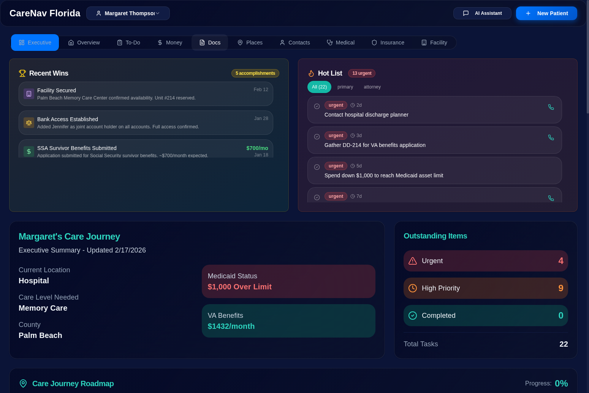
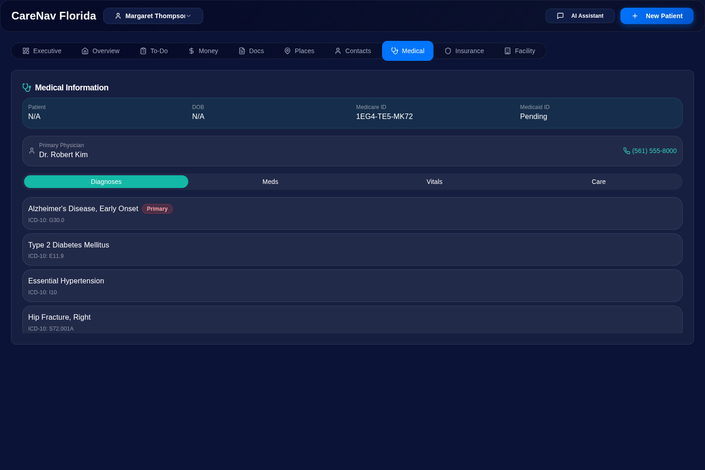
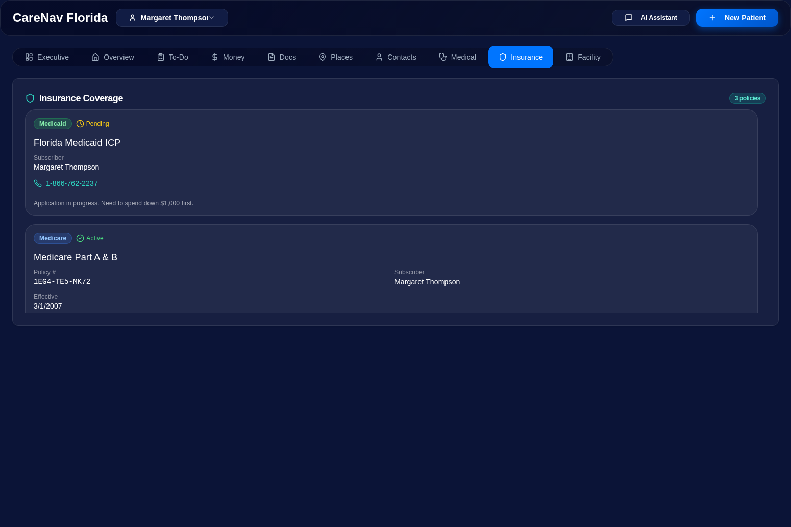
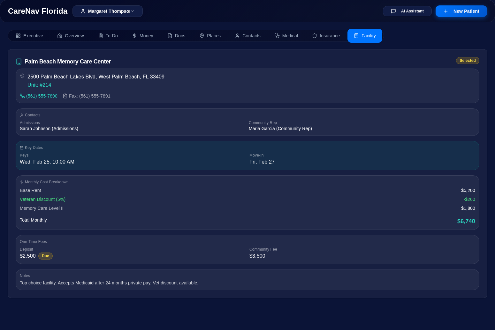
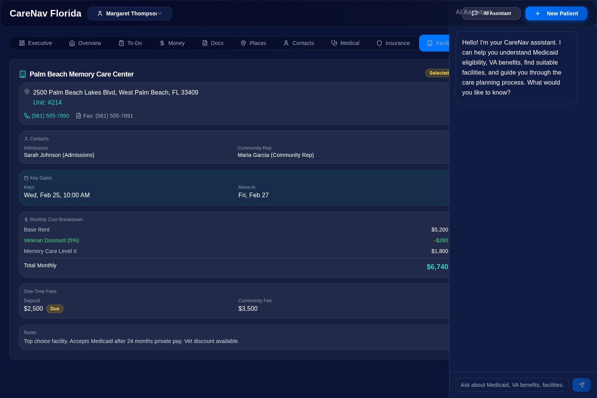
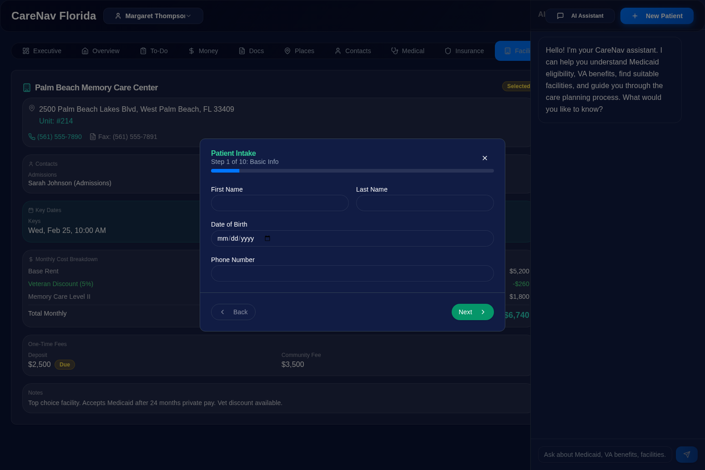
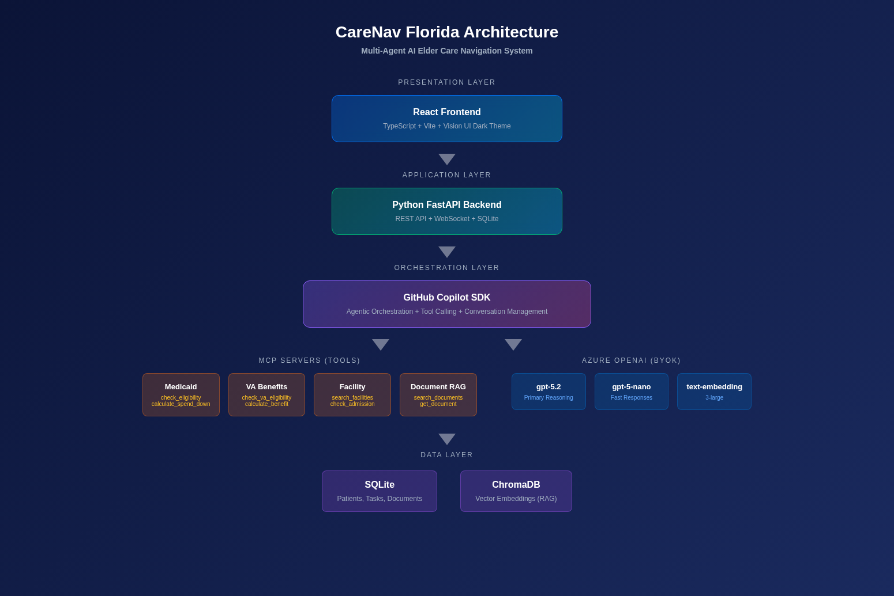

# CareNav Florida

### When Your Parent Can't Come Home: AI That Helps Families Navigate the Impossible

**Built by Gregory Katz and Rick Weyenberg**
**Open Source — Code As-Is**

---

## The Phone Call That Changes Everything

It starts with a phone call. Your mother fell. Your father had a stroke. Your spouse was diagnosed with Alzheimer's.

Within 48 hours, you're standing in a hospital hallway being told your loved one "can't go home." They need skilled nursing. Maybe memory care. Maybe assisted living. A social worker hands you a stack of brochures and says "you'll want to look into Medicaid."

**And then you're on your own.**

You don't know:
- Whether your parent qualifies for Medicaid (Florida has a $2,000 asset limit — did you know that?)
- That your father's Vietnam service means your mother could receive $1,432/month in VA survivor benefits — money most families never claim
- That Florida's 60-month Medicaid look-back period means a gift you made three years ago could disqualify your parent for months
- That the "helpful" advice to put the house in your name could trigger a penalty that costs your family $100,000+
- That Medicare only covers skilled nursing for 100 days — and the clock started the day your parent was admitted
- That the difference between skilled nursing and assisted living isn't just cost ($10,000/month vs $4,500/month) — it's a clinical checklist your parent has to meet before they can transition

**You are now making $500,000+ decisions with zero training, zero guidance, and zero margin for error. While grieving. While working full-time. While your siblings argue about what to do.**

This is not a hypothetical scenario. **10,000 Americans turn 65 every day.** There are 53 million family caregivers in the United States right now, and the vast majority of them are figuring this out alone.

---

## Why CareNav Exists

CareNav Florida was born from lived experience — not a product roadmap.

One of the builders of this system went through this exact crisis with his own family. He spent months navigating Florida Medicaid applications, VA benefits, skilled nursing requirements, assisted living admissions, legal documents, financial planning, and facility selection — all while managing a full-time career and coordinating with siblings, attorneys, social workers, and government agencies across multiple states.

**What he learned:**
- The information exists, but it's scattered across hundreds of government websites, legal documents, and facility brochures
- Every professional you talk to (social workers, attorneys, VA reps, Medicaid caseworkers) only knows their piece — nobody sees the whole picture
- The rules are Florida-specific, complex, and change regularly — what's true for Medicaid in Florida is different from Texas, New York, or California
- Families make catastrophic financial mistakes not because they're careless, but because **nobody told them the rules**
- The emotional toll of being a caregiver while navigating bureaucracy is crushing — and it doesn't have to be this hard

**CareNav is the tool he wished existed when that phone call came.**

---

## What CareNav Actually Does

CareNav Florida is a multi-agent AI system that acts as a **virtual elder care navigator**. Think of it as having six experts sitting with you at the kitchen table — a Medicaid specialist, a VA benefits advisor, a facility placement coordinator, an elder law attorney, a fact-checker, and someone who translates all the jargon into plain English.

### Six AI Agents Working Together

| Agent | What It Does | Why It Matters |
|-------|-------------|----------------|
| **Orchestrator** | Coordinates all agents, routes your questions, synthesizes answers | You ask one question, you get one clear answer — not six conflicting opinions |
| **Eligibility** | Calculates Medicaid/VA/Medicare eligibility with Florida-specific rules | Tells you exactly where you stand: "Your mother is $1,000 over the Medicaid asset limit. Here are three legal ways to spend down." |
| **Facility** | Searches and scores care facilities based on needs, budget, location | Compares skilled nursing vs. assisted living admission requirements and shows what your parent needs to qualify |
| **Legal** | Spend-down strategies, deceased spouse debt rules, required legal documents | Prevents the $100,000 mistakes — "Do NOT put the house in your name. Here's why." |
| **Validator** | Cross-checks every calculation and recommendation | Catches errors before they cost you money or time |
| **Summarizer** | Converts everything into plain English action plans | "This week: 1) Get bank statements. 2) Call the VA at 800-827-1000. 3) Tour Brookdale facility." |

### The Dashboard: Everything In One Place

<p align="center">
  
</p>

**Executive Summary** — Recent Wins (accomplishments like "Facility Secured", "VA Burial Benefit Filed"), Hot List (22 prioritized tasks with due dates), Care Journey Roadmap (8-step progress tracker), Application Status Tracker (Medicaid and VA application progress).

<p align="center">
  
</p>

**Medical Information** — 10 diagnoses with ICD-10 codes, 9 medications with dosages, vitals tracking, and care level assessment. Primary physician contact with click-to-call.

<p align="center">
  
</p>

**Insurance Coverage** — Track all insurance policies: Medicaid (pending), Medicare Part A & B, supplemental plans. Policy numbers, effective dates, and helpline numbers.

<p align="center">
  
</p>

**Selected Facility** — Palm Beach Memory Care Center details: monthly cost breakdown ($6,740 with veteran discount), one-time fees, key dates (keys pickup, move-in), admissions contacts.

<p align="center">
  
</p>

**AI Chat** — Ask anything. "Is my mother ready for assisted living?" "What documents do I need for the VA application?" "Can creditors come after me for my father's medical bills?" Get color-coded answers: Medicaid status (blue), VA benefits (green), action items (orange), warnings (red).

<p align="center">
  
</p>

**Guided Intake** — A 10-step wizard designed for stressed, non-technical family members. No jargon. No assumptions about what you know. Just clear questions and helpful context at every step.

---

## The Demo: Margaret Thompson

To show what CareNav can do, we built a complete scenario based on a composite of real elder care situations:

**Margaret Ann Thompson**, age 83, is a widow living in West Palm Beach, Florida. Her husband Robert was a Vietnam veteran who passed away in 2020. Margaret has been diagnosed with Alzheimer's disease — her cognitive scores have declined from 24 to 16 on the MMSE over three years. She's currently in a skilled nursing facility and her family is trying to transition her to assisted living before Medicare Day 100 runs out.

**Her situation:**
- **Assets**: $3,000 total (checking $1,500 + savings $1,500)
- **Medicaid limit**: $2,000 — she's $1,000 over
- **Monthly income**: $2,425 (Social Security $1,850 + Pension $450 + Interest $125)
- **VA eligible**: $1,432/month as a surviving spouse — money she's not currently receiving
- **Documents collected**: 55 spanning 3 years of medical history and 2 years of bank records

**What CareNav tells her family:**
1. Spend down $1,000 through prepaid burial or medical equipment (legal, won't trigger look-back)
2. File for VA Survivors Pension with Aid & Attendance immediately — that's $1,432/month
3. Margaret meets 4 of 6 assisted living admission criteria — she still needs medical stability documentation and to be discharged from skilled rehab
4. Three facilities within 15 miles accept Medicaid and have availability
5. The deceased spouse's credit card debt is NOT Margaret's responsibility (Florida is a common law property state)

**Without CareNav**, Margaret's family might have spent months figuring this out, missed the VA benefits entirely, and potentially made a costly mistake with the Medicaid spend-down.

---

## The Rules CareNav Knows

### Florida Medicaid ICP (Institutional Care Program)
- **Asset Limit**: $2,000 for individual applicant
- **Income**: No hard cap — income goes toward care costs
- **Look-Back Period**: 60 months for asset transfers
- **Exempt Assets**: Primary home (up to $688,000 equity), one vehicle, prepaid burial
- **Spousal Protections**: CSRA up to $154,140
- **CARES Program**: SNF residents on Medicaid 60+ days can transition to ALF without waitlist

### VA Aid & Attendance
- **Veteran**: Up to $2,229/month (single veteran needing daily assistance)
- **Surviving Spouse**: Up to $1,432/month
- **Requirements**: 90+ days active duty, at least 1 day during wartime, honorable discharge, need help with ADLs
- **Key Insight**: Many families don't know surviving spouses qualify

### Skilled Nursing → Assisted Living Transition
- Must demonstrate medical stability (no frequent changes in physician orders)
- Must be discharged from skilled rehab (home health can continue in ALF)
- Must not be bedridden (unless receiving hospice)
- Must be able to transfer with assistance
- Must be able to take medication with assistance or self-administer
- **Medicare Day 100 deadline** — after this, families pay full skilled nursing rate ($9,000-15,000/month)

### Deceased Spouse Debt
- Florida is a **common law property state**
- Surviving spouse is NOT automatically responsible for the deceased spouse's individual debts
- Credit card companies may call, but calling doesn't create liability

---

## RAG Knowledge Base

CareNav includes a comprehensive RAG (Retrieval-Augmented Generation) knowledge base indexed in ChromaDB that provides AI agents with authoritative rules, policies, and guidance on elder care transitions.

### Knowledge Base Collections

The knowledge base contains 10 policy documents covering:

| Document | Category | Description |
|----------|----------|-------------|
| Florida Medicaid ICP Rules | medicaid | Asset limits, income rules, look-back periods, exempt assets |
| VA Aid & Attendance | va | Eligibility requirements, benefit amounts, required documents |
| Medicare/Medicaid Coordination | medicare | Dual eligible rules, QMB/SLMB programs, coordination of benefits |
| Assisted Living Regulations | facility | Florida ALF licensing, staffing requirements, admission criteria |
| Estate Planning for Elder Care | legal | POA, trusts, Medicaid planning, asset protection strategies |
| Spend-Down Strategies | medicaid | Legal ways to reduce countable assets for Medicaid eligibility |
| Document Requirements | documents | Checklists for Medicaid, VA, and facility applications |
| Care Transition Procedures | transition | SNF to ALF transition timeline, discharge planning, family coordination |
| Deceased Spouse Debt Rules | legal | Florida common law property rules, creditor protections |
| Florida ALF Inspection Guide | facility | Quality indicators, deficiency patterns, what to look for |

### Knowledge Base API

Query the knowledge base via REST API:

```bash
# Semantic search
curl -X POST http://localhost:8000/api/knowledge/query/ \
  -H "Content-Type: application/json" \
  -d '{"query": "What are the Medicaid asset limits for Florida?", "n_results": 3}'

# Export for Azure AI Search migration
curl http://localhost:8000/api/knowledge/export/azure-search/
```

### Azure AI Search Migration

The knowledge base is structured for easy migration to Azure AI Search:
- Consistent metadata fields: `category`, `priority`, `topic`
- Export endpoint returns documents in Azure AI Search bulk upload format
- Vector embeddings compatible with Azure AI Search semantic search

---

## Enterprise Value: Why Health Systems Need This

This is not just a family tool. **Every health system in America manages these transitions at scale.**

Large health systems manage thousands of SNF-to-ALF transitions every year. Each one involves the same eligibility calculations, the same document collection, the same facility matching, and the same family confusion.

**CareNav's architecture is state-agnostic by design:**
- Swap the Medicaid MCP server for any state's program rules
- Update facility search parameters for any region
- All agents, UI, and document management work unchanged

The pattern applies to any organization managing care transitions — anyone with patients moving between levels of care.

---

## Technical Architecture

### How It's Built

```
React Frontend (TypeScript + Vite)
    ↓
Python FastAPI Backend
    ↓
GitHub Copilot SDK (Agentic Orchestration)
    ↓
Copilot CLI (Server Mode)
    ↓                          ↓
MCP Servers                 Azure OpenAI (BYOK)
├── Medicaid Rules          ├── gpt-5.2 (reasoning)
├── VA Benefits             ├── gpt-5-nano (fast responses)
├── Facility Search         └── text-embedding-3-large
└── Document RAG
    ├── ChromaDB (vectors)
    └── SQLite (structured data)
```

<p align="center">
  
</p>

### Azure Integration
- **Azure OpenAI** — Primary LLM via BYOK mode through Copilot SDK
- **Azure AI Search** — Facility database indexing and hybrid search
- **Azure AI Foundry** — Model deployment, endpoint management, and monitoring

### Agent Architecture
| Agent | Role |
|-------|------|
| **Orchestrator** | Routes questions, coordinates responses, manages conversation context |
| **Eligibility** | Florida Medicaid ICP + VA A&A calculations with statute citations |
| **Facility** | Location-based search, scoring (0-100), admission gap analysis |
| **Legal** | Spend-down strategies, debt rules, document requirements |
| **Validator** | Cross-checks all calculations and flags inconsistencies |
| **Summarizer** | Plain English action plans with deadlines and phone numbers |

### MCP Servers
| Server | Tools Exposed |
|--------|--------------|
| **Medicaid** | `check_eligibility`, `get_rules`, `calculate_spend_down`, `check_look_back` |
| **VA Benefits** | `check_va_eligibility`, `calculate_benefit`, `get_required_documents` |
| **Facility Search** | `search_facilities`, `compare_facilities`, `check_admission_requirements` |
| **Document RAG** | `search_documents`, `get_document`, `list_documents` |

---

## Local Setup (VS Code)

### Prerequisites
- Python 3.11+
- Node.js 18+
- GitHub Copilot CLI (installed and authenticated)
- GitHub Copilot license
- Azure OpenAI endpoint (for BYOK mode)

### Step 1: Clone
```bash
git clone https://github.com/gregorykatz/carenav-florida.git
cd carenav-florida
```

### Step 2: Backend
```bash
cd src/backend
cp .env.example .env
# Edit .env with your Azure OpenAI credentials
pip install poetry
poetry install
poetry run fastapi dev app/main.py
```

### Step 3: Frontend
```bash
cd src/frontend
cp .env.example .env
# Set VITE_API_URL=http://localhost:8000
npm install
npm run dev
```

### Step 4: Copilot SDK Integration
```bash
# Install Copilot CLI
npm install -g @github/copilot-cli
copilot-cli auth login

# Install SDK
npm install @github/copilot-sdk

# Switch provider in src/backend/app/services/llm_service.py:
# Change: provider = "copilot_sdk"
```

### Step 5: Open browser
Navigate to `http://localhost:5173` — Margaret Thompson demo loads automatically.

---

## Challenge Submission Checklist (Due Mar 7, 10 PM PST)

- [ ] 150-word project summary — `/submissions/project_summary.md`
- [ ] 3-min demo video — record and upload to submission form
- [ ] Working GitHub repo with README, architecture diagram, setup instructions
- [ ] Presentation deck (1-2 slides) — `/presentations/CareNavFlorida.pptx`
- [ ] AGENTS.md — agent definitions and custom instructions
- [ ] mcp.json — MCP server configuration
- [ ] Product feedback screenshot — post in SDK team channel
- [ ] Customer validation — `/customer/README.md`

---

## Test Results

**100% Pass Rate (23/23 tests)**

| Category | Tests | Status |
|----------|-------|--------|
| Health Check | 1 | ✅ |
| Patient Management | 2 | ✅ |
| Document Storage | 3 | ✅ |
| Medicaid Eligibility | 1 | ✅ |
| VA Eligibility | 1 | ✅ |
| Facility Search | 1 | ✅ |
| AI Chat Scenarios | 12 | ✅ |
| Task Management | 2 | ✅ |

---

## License

MIT License — Copyright (c) 2026 Gregory Katz and Rick Weyenberg

Code is as-is, open source.

---

## Authors

**Gregory Katz** — Director, Cloud & AI Platforms, Microsoft Corporation
**Rick Weyenberg** — Microsoft

*CareNav Florida was built because one of us lived this crisis and wished this tool existed. Every feature in this system addresses a real problem that real families face every day.*
